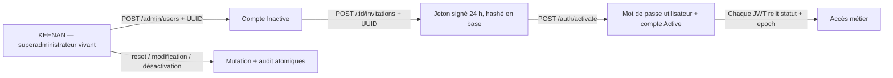

# SOL-02 — Fusionner et sécuriser la création des comptes

Date d’exécution : 2026-08-09

Dépôt : `erp-crp-backend`

Branche : `fix/sol-02-account-provisioning-security`

Base SOL-01 : `840ee3d docs(release): record SOL-01 baseline reconciliation`

État : implémenté et vérifié localement ; aucune écriture production, aucun push.

## Diagnostic et cause racine

`POST /api/v1/auth/register` était déjà absent et le frontend `/signup` était informatif. La frontière restante n’était toutefois pas sûre : le routeur d’administration utilisait des rôles, tandis que l’accès accordé au module pouvait court-circuiter `authorizeRole`; un compte non superadministrateur pouvait donc atteindre les routes `/admin/users`. Le statut vivant n’était relu ni au login ni après validation d’un JWT, de sorte qu’un compte inactif pouvait se connecter et qu’un JWT déjà délivré survivait à une désactivation.

La création administrative acceptait encore un mot de passe et un statut actif. Les invitations/activations n’existaient pas. Les mises à jour, resets et suppressions n’avaient pas une piste d’audit complète ; `DELETE` supprimait physiquement le compte. Enfin, le frontend recréait une clé UUID après une erreur ambiguë, annulant l’idempotence réseau.

Le schéma `users` ne contient aucune clé société, tenant ou site. Une isolation multi-société/site ne peut donc pas être honnêtement revendiquée dans ce lot.

## Architecture retenue

- Toutes les routes `/admin` exigent `authenticateToken`, puis `requireSuperadmin`, qui relit `status='Active'` et `is_superadmin` en base. Un rôle ou un droit de module ne suffit plus.
- La création force `Inactive`, refuse le mot de passe administrateur et stocke un secret bootstrap aléatoire inutilisable.
- L’invitation signée HS256 est limitée à 24 heures, liée au compte, stockée seulement sous empreinte SHA-256 et remplacée lors d’une nouvelle émission.
- L’activation verrouille invitation et utilisateur, définit le hash bcrypt, active, consomme le jeton, incrémente l’epoch et audite dans une transaction. Un retry après succès est un replay sans seconde écriture du secret.
- Création, invitation et création de reset administratif exigent une `Idempotency-Key` UUID et rejouent le même résultat après erreur ambiguë. Une clé réutilisée avec une autre requête retourne `409 IDEMPOTENCY_CONFLICT`.
- Les changements de cycle de vie et resets sont audités dans la transaction métier. Les détails excluent mot de passe, jeton, email et données RH.
- `DELETE /admin/users/:id` est retiré. La désactivation par `PATCH` conserve les relations et l’historique. Le cycle de vie du superadministrateur ne peut pas être modifié par cette API.
- Login et middleware JWT relisent le statut vivant. L’epoch invalide les sessions après mutation sensible.

## Fichiers modifiés

### Runtime et contrats

- `src/module/auth/domain/account-invitation.ts`
- `src/module/auth/repository/account-invitation.repository.ts`
- `src/module/auth/repository/auth.repository.ts`
- `src/module/auth/services/auth.service.ts`
- `src/module/auth/controllers/auth.controller.ts`
- `src/module/auth/middlewares/auth.middleware.ts`
- `src/module/auth/validators/auth.validator.ts`
- `src/module/auth/routes/auth.routes.ts`
- `src/module/admin/repository/admin.repository.ts`
- `src/module/admin/services/admin.service.ts`
- `src/module/admin/controllers/admin.controller.ts`
- `src/module/admin/validators/admin.validators.ts`
- `src/module/admin/routes/admin.routes.ts`
- `src/module/access-control/repository/access-control.repository.ts`
- `src/routes/v1.routes.ts`

### Migration et documentation

- `db/patches/20260809_account_invitation_activation.sql`
- `db/patches/support/20260809_account_invitation_activation.preflight.sql`
- `db/patches/support/20260809_account_invitation_activation.verify.sql`
- `db/patches/support/20260809_account_invitation_activation.rollback.sql`
- `docs/http/account-provisioning.md`
- `docs/database-patches.md`
- `docs/frontend_repo_map.md`
- `docs/runbooks/auth-rate-limit-deployment.md`
- `docs/execution-reports/SOL-02.md`

### Tests

- `src/__tests__/account-activation.repository.test.ts`
- `src/__tests__/account-invitation.domain.test.ts`
- `src/__tests__/account-provisioning.migration-guards.test.ts`
- `src/__tests__/admin-account-invitation.repository.test.ts`
- `src/__tests__/auth-active-account.middleware.test.ts`
- `src/__tests__/auth-login-status.service.test.ts`
- `src/__tests__/access-control.test.ts`
- `src/__tests__/admin-user-provisioning.routes.test.ts`
- `src/__tests__/admin-user-provisioning.service.test.ts`
- `src/__tests__/admin-user-provisioning.validator.test.ts`
- `src/__tests__/auth.routes.test.ts`
- `src/__tests__/multi-role-rbac.test.ts`
- `src/module/admin/repository/admin-password-reset.repository.test.ts`
- `src/module/admin/services/admin-password-reset.service.test.ts`

## Migration et changements de données

Le patch crée `account_invitations` et ajoute à `password_reset_tokens` les métadonnées nécessaires à l’auteur et à l’idempotence du reset administratif, avec index uniques et contraintes. Aucune base de production n’a été contactée ou modifiée.

Validation destructive réalisée uniquement dans PostgreSQL 16 Alpine jetable, conteneur `cerp-sol02-pg-20260809-2242` :

1. schéma minimal isolé et données synthétiques ;
2. preflight en lecture seule : `t` ;
3. sauvegarde `pg_dump -Fc`, catalogue relu par `pg_restore --list` ;
4. patch appliqué sans erreur ;
5. verify : sept assertions booléennes à `t` ;
6. rollback gardé exécuté sans preuve métier ;
7. validation post-rollback : table et colonnes ajoutées absentes (`t|t`) ;
8. conteneur vérifié puis supprimé.

En production, l’ordre obligatoire reste : preflight → sauvegarde restaurable et vérifiée → patch par le runner → verify. Il n’a pas été exécuté ici.

## Tests exécutés et résultats

| Commande | Résultat |
|---|---|
| `npm run test:collection` | succès, 257 fichiers collectés, manifeste SHA-256 `b5b7ce3c226f81e2e94bb1be036e97424d19c048e35b224683423f24ae628245` |
| `npm run test:run -- --reporter=json --outputFile=... --silent` | succès, 869 suites, 4 365 tests réussis, 4 ignorés, 0 échec |
| `npm run build` | succès, `tsc -p tsconfig.json` |
| `git diff --check` | succès |

Le dépôt backend ne déclare pas de script lint ; aucun résultat lint backend n’est inventé.

Le binaire compilé a été démarré avec `NODE_ENV=test`, port `5057`, stockage sous `%LOCALAPPDATA%/Temp/cerp-sol02-app-boot-20260809` et `DATABASE_URL` pointant vers `127.0.0.1:65432/cerp_sol02_boot`, volontairement non-production. Les marqueurs `preflight ready` et `Serveur CERP lance` ont été observés. Le PID propriétaire du port a été identifié puis arrêté. Les tâches de maintenance ont logiquement journalisé l’indisponibilité de cette base jetable absente ; le démarrage HTTP lui-même était effectif.

## Vérification navigateur / E2E

Exécutée depuis le worktree frontend avec Chromium et `--retries=0` : trois scénarios réussis en 10,5 s.

- `/signup` ne présente aucun formulaire public ;
- une invitation expirée ne peut pas activer un compte ;
- le panneau KEENAN affiche invitation et reset, ne propose ni mot de passe à la création ni suppression physique, force le statut initial inactif et envoie une UUID d’idempotence.

Les API du panneau sont simulées uniquement pour la recette UI. Les autorisations et transactions serveur ne reposent pas sur ce mock : elles sont couvertes dans la suite backend complète, notamment anonyme, utilisateur standard, superadministrateur, doublon, invitation expirée et reprise après commit ambigu.

## Risques et compatibilité

- Changement volontairement incompatible : les anciens clients envoyant `password`, demandant `Active`, appelant `DELETE /admin/users/:id` ou omettant `Idempotency-Key` sont refusés. Le frontend SOL-02 est la version compatible.
- Le lien d’invitation est produit dans le panneau pour transmission par un canal approuvé ; aucun expéditeur email automatique n’est ajouté dans ce lot.
- Une désactivation HTTP devient immédiate. Les connexions Socket.IO déjà établies devront être revérifiées dans un lot dédié si une révocation temps réel instantanée est exigée.
- `npm ci --ignore-scripts` a signalé 5 vulnérabilités npm de sévérité haute déjà présentes. Aucun `npm audit fix` non borné n’a été exécuté ; triage séparé requis.
- Il n’existe toujours pas de modèle société/site. Ajouter une multi-tenance exige un ADR et des tests anti-IDOR dédiés.
- L’arborescence de stockage du démarrage local ne contenait que des dossiers vides ; elle a été supprimée explicitement après arrêt du processus.

## Rollback

Avant déploiement, abandonner la branche suffit : aucune donnée réelle n’a changé. Après déploiement applicatif sans migration consommée, revenir aux artefacts frontend/backend précédents et exécuter le rollback SQL après son preflight.

Le rollback SQL refuse volontairement de détruire `account_invitations` ou les métadonnées de reset dès qu’une preuve métier existe. Dans ce cas : désactiver les nouvelles routes au niveau du déploiement, conserver les tables et audits, diagnostiquer, puis corriger en avant. Restaurer une sauvegarde complète n’est acceptable qu’en reprise sinistre coordonnée, car cela écraserait les écritures métier postérieures.

## Reste réellement à faire

1. Revue humaine puis push/PR des deux branches SOL-02 ; aucun push n’a été autorisé ou effectué.
2. Déploiement coordonné : backend + patch vérifié avant frontend, avec sauvegarde et fenêtre de rollback.
3. Configurer le canal approuvé de remise des liens d’invitation ; le panneau permet déjà leur génération et copie.
4. Triage séparé des 5 alertes npm hautes.
5. Concevoir société/site et révocation Socket.IO seulement si ces exigences sont confirmées.

Le bootstrap initial reste `db/seeds/access-tower-superadmin-keenan.sql`. En production, il exige `SET cerp.access_tower_superadmin_approved='KEENAN'`; aucune route HTTP ne peut attribuer `is_superadmin`.
