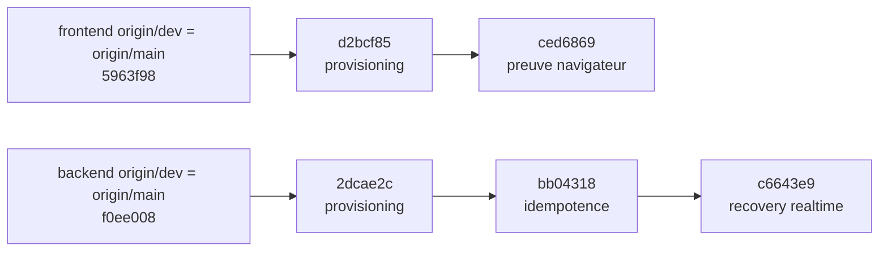

# SOL-01 — Réconciliation de la base de release

Date de l'inventaire : 2026-08-09

Périmètre : `crp-systems-web` et `erp-crp-backend`

Statut : candidats locaux propres, non poussés ; qualification de release encore conditionnelle.

## Base canonique et branches candidates

Après `git fetch --all --tags` sans prune, `origin/dev` et `origin/main` pointaient sur le même commit dans chaque dépôt. La politique locale conserve `dev` pour l'intégration et `main` pour la production.

| Dépôt | Base canonique | Branche candidate | Chaîne fonctionnelle ajoutée |
| --- | --- | --- | --- |
| Frontend | `5963f98831b55b4bd2beba531842a5b3a56f47ed` | `integration/sol-01-release-baseline` | `d2bcf85` → `ced6869` |
| Backend | `f0ee00817980136fd0dae6a7c9c6d45aaab06503` | `integration/sol-01-release-baseline` | `2dcae2c` → `bb04318` → `c6643e9` |

Les worktrees d'intégration sont isolés sous `cerp-sol01-baseline/frontend` et `cerp-sol01-baseline/backend`. Aucune branche n'a été poussée.

## Inventaire Git

| Mesure | Frontend | Backend |
| --- | ---: | ---: |
| Worktrees existants avant création des candidates SOL-01 | 130 | 121 |
| Worktrees sales / manquants | 10 / 0 | 7 / 0 |
| Branches distantes analysées | 266 | 186 |
| Ancêtres exactes de `origin/dev` | 232 | 151 |
| Équivalentes par patch | 13 | 11 |
| Patches distants encore uniques | 21 | 24 |
| Branches locales analysées, hors sauvegardes | 268 | 172 |
| Ancêtres exactes | 240 | 151 |
| Équivalentes par patch | 15 | 12 |
| Patches locaux encore uniques | 13 | 9 |
| Uniques et non publiés | 9 | 7 |

Après création des deux worktrees d'intégration, l'état final comporte 131 worktrees frontend et 122 backend. Les deux ajouts sont les candidates SOL-01 et leur statut Git est propre.

Avant l'opération, `main`/`dev` frontend avaient 47/55 commits de retard ; `main` backend était à jour et `dev` avait 11 commits de retard. Les WIP provisioning avaient 166 commits de retard côté frontend et 440 côté backend. Ils sont supplantés par les branches `fix/532-account-provisioning-boundary` et `fix/366-admin-user-provisioning-boundary`, directement basées sur les références distantes ci-dessus.

## Sauvegardes traçables

Chaque arbre sale a été capturé avec un index Git temporaire ; l'index et le contenu du worktree d'origine n'ont pas changé. Les 17 fichiers d'index temporaires ont été supprimés. Le ré-audit retrouve les mêmes 10 arbres frontend et 7 backend sales, avec les mêmes nombres d'entrées.

### Frontend — 10 sauvegardes

| Source | Branche de sécurité | Commit |
| --- | --- | --- |
| racine `b3ffe1f`, 311 entrées | `safety/sol-01-20260809/frontend-b3ffe1f-wip-532` | `92c10d8` |
| docs `be8a399`, 9 | `safety/sol-01-20260809/frontend-be8a399-docs-222-downstream-prompts` | `f609645` |
| clients `45f939e`, 3 | `safety/sol-01-20260809/frontend-45f939e-claude-create-clients` | `7846f1d` |
| client 360 `d915ff1`, 1 | `safety/sol-01-20260809/frontend-d915ff1-feature-162-client-360` | `b9e285a` |
| GED `b109cb8`, 22 | `safety/sol-01-20260809/frontend-b109cb8-claude-logo-avatar-ged` | `2696fe6` |
| OF `5e0753d`, 6 | `safety/sol-01-20260809/frontend-5e0753d-feature-370-of-export` | `0e31434` |
| Livraison `40a8cb5`, 20 | `safety/sol-01-20260809/frontend-40a8cb5-feature-36-livraison` | `604cdbe` |
| VSM `1016455`, 16 | `safety/sol-01-20260809/frontend-1016455-feature-141-vsm` | `d20c6da` |
| Electron `c286782`, 14 | `safety/sol-01-20260809/frontend-c286782-fix-325-electron-updates` | `999bc71` |
| accès `fafe6f5`, 1 | `safety/sol-01-20260809/frontend-fafe6f5-fix-422-account-access` | `5ec73ce` |

### Backend — 7 sauvegardes

| Source | Branche de sécurité | Commit |
| --- | --- | --- |
| Article `68a056a`, 1 entrée | `safety/sol-01-20260809/backend-68a056a-feature-164-article-registry` | `3390761` |
| Affaire `a7832f2`, 1 | `safety/sol-01-20260809/backend-a7832f2-feature-169-affaire-record` | `c284b50` |
| OF `91d9725`, 90 | `safety/sol-01-20260809/backend-91d9725-feature-224-of-export` | `559412b` |
| surface finish `9ee8087`, 1 | `safety/sol-01-20260809/backend-9ee8087-claude-surface-finish-test` | `c901817` |
| GED fiches `22a2aaf`, 14 | `safety/sol-01-20260809/backend-22a2aaf-feature-ged-fiches-360` | `1cdc0c1` |
| Livraison `4a87c81`, 11 | `safety/sol-01-20260809/backend-4a87c81-feature-36-livraison` | `07d3d81` |
| accès `2fe0d4d`, 1 | `safety/sol-01-20260809/backend-2fe0d4d-fix-268-account-access` | `2b758dc` |

Les scans des deux anciennes bases backend ont uniquement relevé les URI de CI factices `postgres://ci:ci...` déjà présentes dans les workflows historiques, pas dans les deltas sauvegardés. Aucun secret nouveau n'a été détecté.

## Provenance et décisions

### Intégré

- `d2bcf85` repose la fermeture du signup public et le provisioning administrateur frontend sur `origin/dev`.
- `2dcae2c` repose le provisioning backend sécurisé avec auth, RBAC, validation, audit, idempotence, migration et rollback.
- `bb04318` fournit aux tests multi-rôle l'en-tête d'idempotence désormais obligatoire ; le contrat sensible n'est pas relâché.
- `c6643e9` rend l'observation de l'état socket dégradé déterministe sans timeout augmenté.
- `ced6869` prouve dans un navigateur que `/signup` ne contient aucun formulaire et renvoie vers `/login`.
- Le delta sauvegardé `c901817` est déjà représenté dans le canonique par `a7968961` et `acefb833` ; le test courant passe 31/31.

### À rebaser dans des lots dédiés

| Lot | Décision |
| --- | --- |
| Article (`origin/feature/164-article-master-data`, `3390761`) | Refaire un lot cross-repo : frontend 484 commits en retard et SQL backend seulement local. |
| OF (`0e31434`, `559412b`) | Séparer code, migrations, tests et PDF générés ; exécuter le protocole migration complet. |
| GED fiches (`2696fe6`, `1cdc0c1`) | Rebaser les deux dépôts ensemble après la convergence de sécurité GED. |
| Livraison (`604cdbe`, `07d3d81`) | Rebase cross-repo et E2E métier dédiés. |
| Messagerie `fix/ux-messagerie-navigation` | 16 fichiers, 1 112 ajouts et 331 commits de retard ; lot fonctionnel/visuel distinct avec revue design. |
| Electron `999bc71` | Valider le packaging sur une matrice desktop avant fusion. |
| Clients, VSM, affaires, docs | Revue propriétaire, puis PR thématiques à partir des sauvegardes. |
| `feature/ged-vault-readonly-marker` | Réappliquer uniquement avec preuve opérationnelle du mode lecture seule. |

Les `__pycache__`, PDF de preuve et réglages IDE sont conservés dans les sauvegardes pour ne rien perdre, mais ne sont pas intégrables comme code produit.

### Conflit fonctionnel P0

Le couple backend `origin/fix/236-ged-scope-security` (`fa2fa7e`) / frontend `origin/fix/394-ged-access-scope` (`6c5ea0c`) rend les noms de rôles autoritatifs dans `ged_class_capabilities`. Le provisioning courant rend les rôles descriptifs et le couple compte/module autoritatif. Un cherry-pick backend d'analyse a produit six conflits dans routes, contrôleur, domaine, middleware, repository et service. Le cherry-pick a été abandonné proprement.

Décision : ne pas fusionner partiellement. Concevoir des grants GED attachés à un `account_id` ou à des groupes stables et compatibles avec le module gate ; ajouter migration, preflight, sauvegarde, vérification, rollback et tests de non-fuite ; rebaser ensuite les deux correctifs ensemble.

Les anciennes branches `fix/230-module-read-access` et `fix/379-module-read-access-docs` ont le même problème de modèle : elles doivent être réconciliées avec la tour d'accès actuelle, pas cherry-pickées séparément.

### Supplanté ou à abandonner comme branche de fusion

- checkpoints WIP provisioning : remplacés par `d2bcf85`/`2dcae2c`, mais conservés comme provenance ;
- `feature/302-isolated-test-backend` : intention couverte par ADR-0034 et l'isolation courante ;
- `feature/277-reporting-commercial-360` et `feature/143-reporting-commercial-360` : supplantés par le reporting fusionné ;
- `feature/of-versioning-planning-ar-pdf` : supplanté par les lots OF plus récents ;
- `origin/feat/admin-page`, `origin/feat/gpao-v2`, `origin/codex/ai-governance-cleanup`, `origin/codex/commande-inline-workspace` : branches monolithiques et fortement en retard ;
- 17 branches Dependabot frontend et 22 backend : ne pas fusionner leurs vieux lockfiles ; recréer des mises à jour de sécurité depuis le canonique actuel.

Les 22 branches Dependabot backend restantes concernent `body-parser`, `brace-expansion`, `dotenv`, `form-data`, `helmet`, `js-yaml`, `jws`, `morgan`, `multer`, quatre groupes `multi-*`, `pdfkit`, `postcss`, `socket.io`, `swagger-jsdoc`, `@types/node`, `validator`, `vite`, `vitest` et `zod`.

## Validations réelles

### Backend

| Commande / preuve | Résultat |
| --- | --- |
| `npm ci --ignore-scripts` | 399 paquets installés depuis le lockfile ; 5 vulnérabilités hautes signalées par npm audit, sans correction automatique. |
| `npm run build` | Succès ; `tsc -p tsconfig.json` couvre typecheck et build. |
| `npm run test:run -- --silent --reporter=dot` | 250 fichiers réussis, 1 ignoré ; 4 350 tests réussis, 4 ignorés ; 18,71 s. |
| Provisioning ciblé | 7 fichiers, 23/23. |
| Garde migration `surface_finish` | 31/31. |
| Multi-rôle + validation admin | 16/16. |
| Socket ACL, cinq exécutions séquentielles | 31/31 à chaque exécution. |
| Lint | Non disponible : aucun script lint n'existe dans `package.json`. |

### Frontend et navigateur

| Commande / preuve | Résultat |
| --- | --- |
| `pnpm ci:frontend` | Lint, `tsc -b`, 259 fichiers/2 382 tests et build Vite réussis. |
| `pnpm ci:governance` | Architecture, documentation et secrets réussis. |
| Playwright signup fermé, serveur isolé | 1/1 en 20,6 s. |
| Playwright complet, serveur isolé | 10 réussis, 16 échoués, 29 ignorés en 6,3 min. Premier défaut explicite : `E2E_PASSWORD` absent ; les scénarios authentifiés ne rejoignent pas leurs pages métier. Le scénario SOL-01 passe. |

Le build frontend avertit de chunks supérieurs à 500 kB, dont `document-kit` ≈ 1,52 MB, `Dashboard` ≈ 984 kB et `AtelierScene3D` ≈ 938 kB.

## Migration jetable

La migration `20260803_admin_user_provisioning_boundary.sql` a été exécutée dans PostgreSQL 16 Alpine, conteneur `cerp-sol01-pg-20260809-2052`, base factice `cerp_sol01` : preflight, fixture factice, `pg_dump -Fc`, contrôle `pg_restore --list`, forward, vérification `t,t,t,t`, rollback, puis vérification `t,t,t` des tables absentes et des 12 colonnes RH revenues à `NOT NULL`. Le conteneur a été supprimé. Un premier conteneur, arrêté avant création de la base à cause d'une course de disponibilité, n'a exécuté aucune migration et a aussi été supprimé. Aucune donnée de production n'a été lue ou écrite.

## Risques

1. P0 : cloisonnement GED non convergé avec la nouvelle frontière d'autorisation.
2. Qualification E2E authentifiée non reproductible sans compte/tenant/backend/base jetables et `E2E_PASSWORD`.
3. Cinq vulnérabilités npm hautes dans le backend ; les vieilles branches Dependabot ne sont pas une remédiation fiable.
4. Chunks frontend volumineux.
5. Dérive documentaire : le frontend dit que le backend est autoritatif, tandis que `erp-crp-backend/AGENTS.md` le qualifie encore d'« implementation backup ».
6. Les 251 worktrees et centaines de branches augmentent le risque de repartir d'un mauvais socle.
7. ADR-0032 maintient GitHub Actions désactivé ; ces preuves sont locales, pas des checks distants.

## Rollback

Les candidates ne sont pas publiées : ne pas les utiliser suffit, puis repartir de `5963f98` et `f0ee008`. Après publication, utiliser des `git revert` dans l'ordre inverse, sans réécriture de l'historique partagé.

Pour une exécution réelle de la migration : preflight, sauvegarde restaurable, fenêtre validée et vérification sont obligatoires ; utiliser le script rollback fourni seulement après contrôle humain. Les 17 branches `safety/sol-01-20260809/*` sont les points de restauration des changements locaux et ne doivent pas être supprimées avant reprise par leurs propriétaires.

## Restant réellement à faire

1. Exécuter les 55 scénarios Playwright dans un environnement entièrement isolé et authentifié, puis obtenir zéro échec non classé.
2. Produire l'ADR de convergence GED, implémenter le principal stable et rebaser ensemble frontend/backend avec tests de non-fuite.
3. Recréer les mises à jour de dépendances depuis les lockfiles actuels et fermer les cinq alertes hautes.
4. Reprendre dans des PR séparées Article, OF, GED fiches, Livraison, Messagerie et Electron.
5. Clarifier l'autorité documentaire du backend puis archiver les branches réellement supplantées sans suppression forcée.
